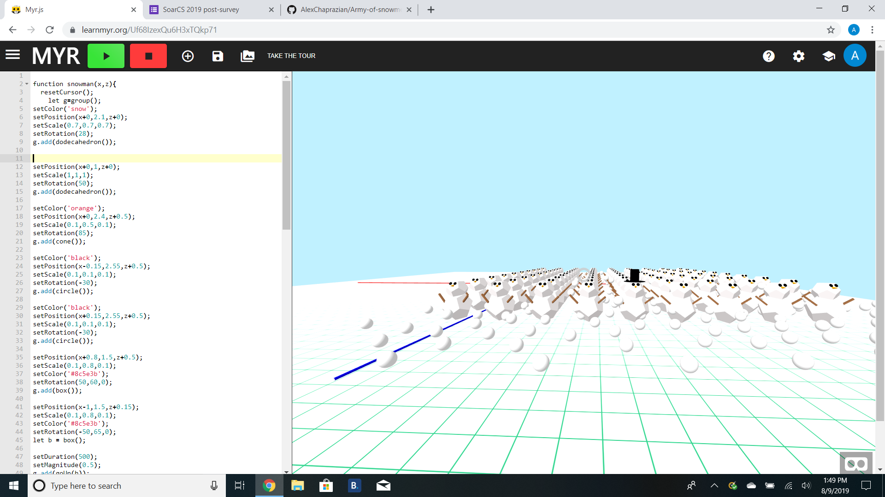

# SoarCS 2019!

<!-- Note, the line below this one is what links to your screenshot, **DO NOT REMOVE** -->

<!--
In this file, you should write a brief description of what your
project is, what you learned, and a simple screenshot of your work.

To add a screenshot, please replace `screenshot.png` with
your own screenshot.
-->

## Army of Snowmen

An army of snowmen band together during a snow strom lead by the snowman with a top hat
This project was made during the Summer 2019 event SoarCS ran by Fred Martin at UML.
It was meant to introduce first gen college students to what life at university would be like
including the aspects of taking part in a computer science major.
